# 🚚 Transportes Linhares - Site Institucional

Este é o repositório do site institucional da Transportes Linhares, uma empresa de logística focada na Região Central de Minas Gerais. O projeto foi desenvolvido com React, TypeScript e Vite, com foco em um design limpo, profissional e responsivo (Mobile-First).

> **Site no ar:** [transportelinhares.vercel.app](https://transportelinhares.vercel.app/)

---

  <strong>Preview do Site (Desktop e Mobile)</strong>

<table align="center" style="border: none;">
  <tr>
    <td align="center">
      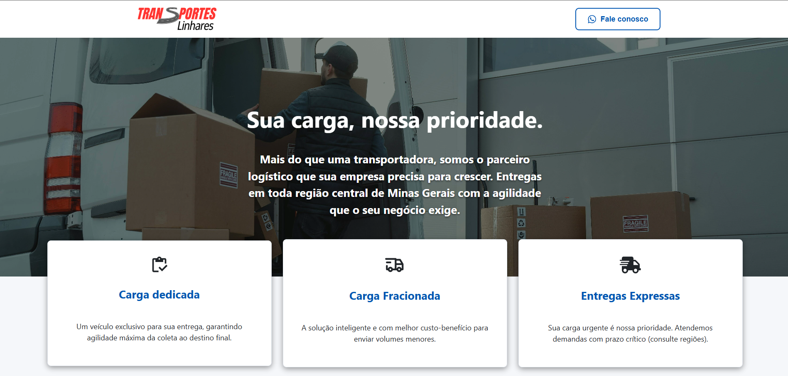
    </td>
    <td align="center">
      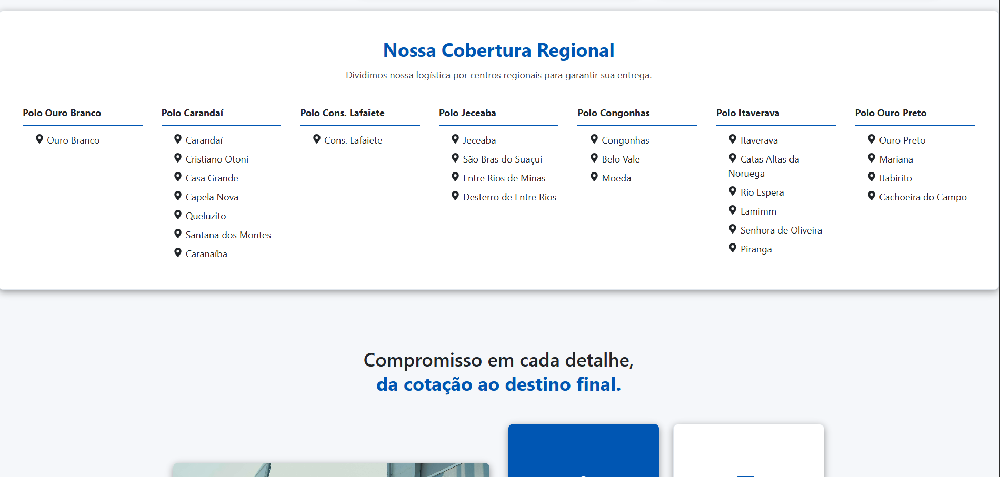
    </td>
    <td align="center">
      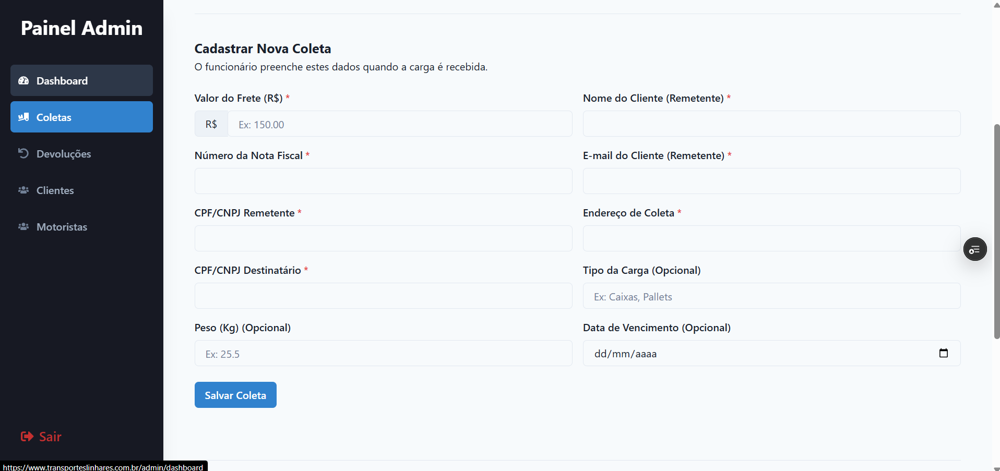
    </td>
    <td align="center">
      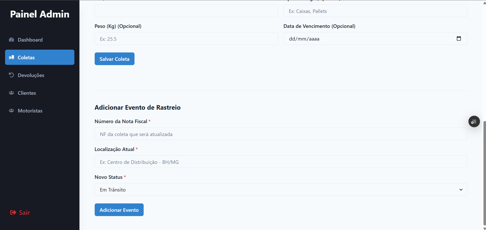
    </td>
  </tr>
  <tr>
    <td align="center">
      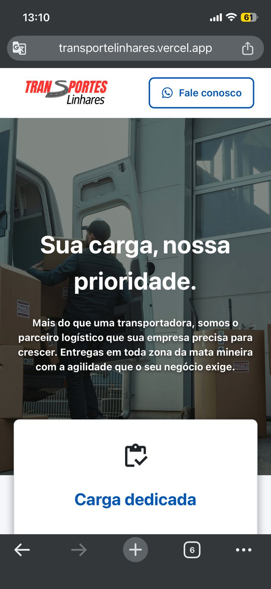
    </td>
    <td align="center">
      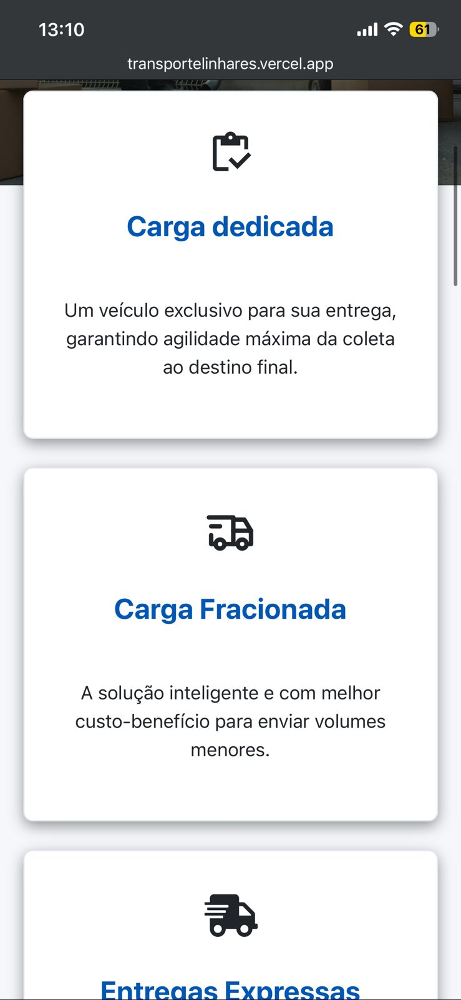
    </td>
    <td align="center">
      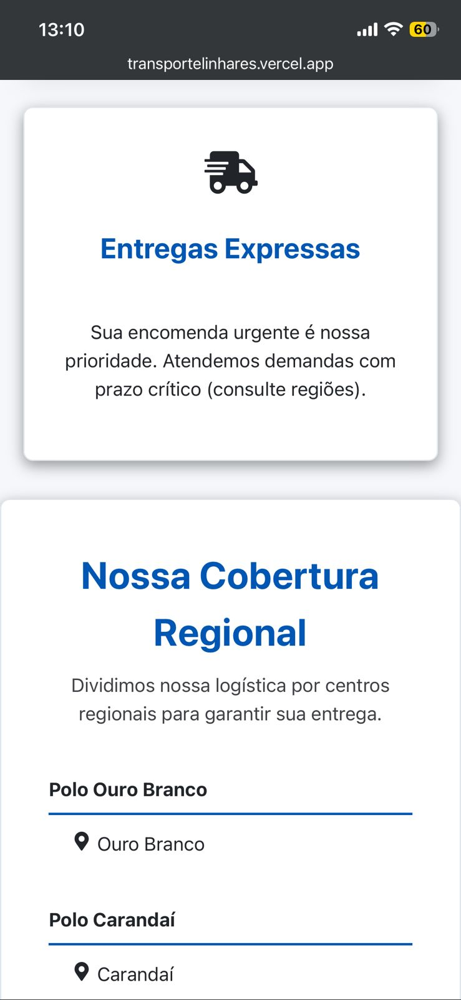
    </td>
    <td align="center">
      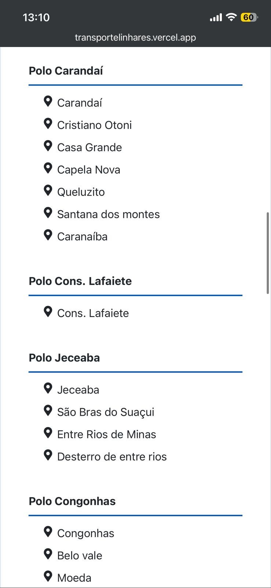
    </td>
    <td align="center">
      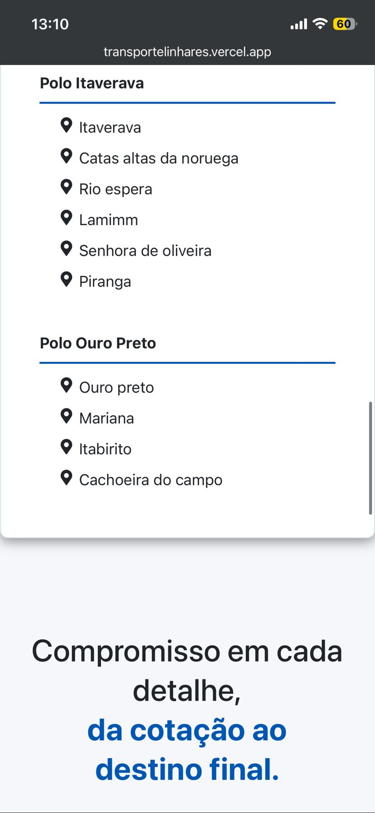
    </td>
    <td align="center">
      
    </td>
    <td align="center">
      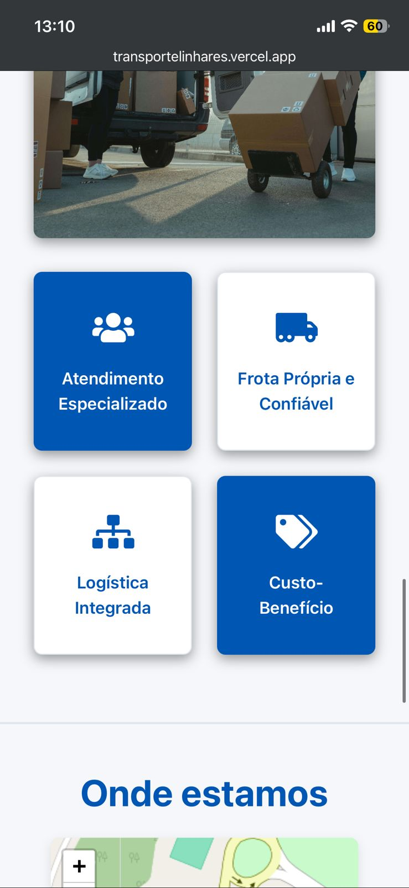
    </td>
    <td align="center">
      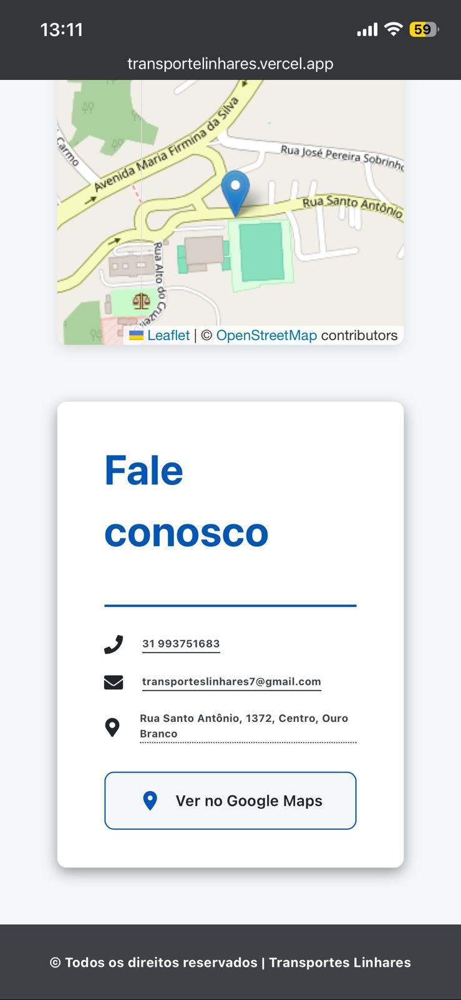
    </td>
    <td align="center">
      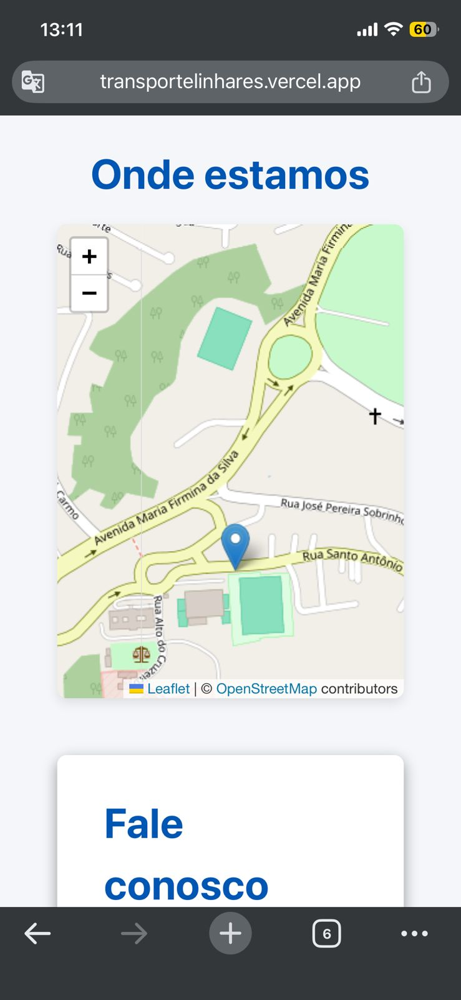
    </td>
  </tr>
</table>

## ✨ Funcionalidades

* **Design Responsivo:** Layout 100% adaptado para Mobile, Tablet e Desktop usando CSS Grid e Flexbox.
* **Seção de Diferenciais:** Um grid 2x2 destacando os pontos fortes da empresa (Atendimento, Frota, Logística Integrada, etc.).
* **Cobertura Regional:** Seção dinâmica em CSS Grid exibindo todos os polos de atendimento da transportadora.
* **Localização e Contato:** Seção com mapa interativo (via `react-leaflet`) e um card de contato com links diretos para o Google Maps.
* **CTAs (Call-to-Action):** Botões de "Fale Conosco" com links diretos para a API do WhatsApp.
* **SEO e Acessibilidade:** Uso correto de tags (`lang="pt-BR"`) e atributos (`translate="no"`) para impedir traduções incorretas de nomes próprios.

## 🛠️ Tecnologias Utilizadas

* **React** (Biblioteca principal)
* **TypeScript** (Para tipagem estática)
* **Vite** (Build tool e servidor de desenvolvimento)
* **CSS** (CSS puro para estilização, seguindo o padrão Mobile-First)
* **React Leaflet** (Para o mapa interativo da seção "Onde Estamos")
* **React Icons** (Biblioteca de ícones)
* **vite-plugin-svgr** (Para importar SVGs como componentes)
* **Vercel** (Plataforma de hospedagem e deploy contínuo)

## 🚀 Rodando o Projeto Localmente

## 🌐 Deploy

O projeto está configurado com **Deploy Contínuo** na [Vercel](https://vercel.com). Qualquer `push` ou `merge` para a branch `main` iniciará um novo build e atualizará o site de produção automaticamente.

