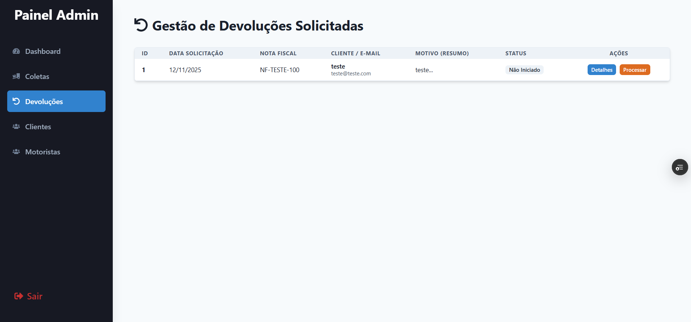
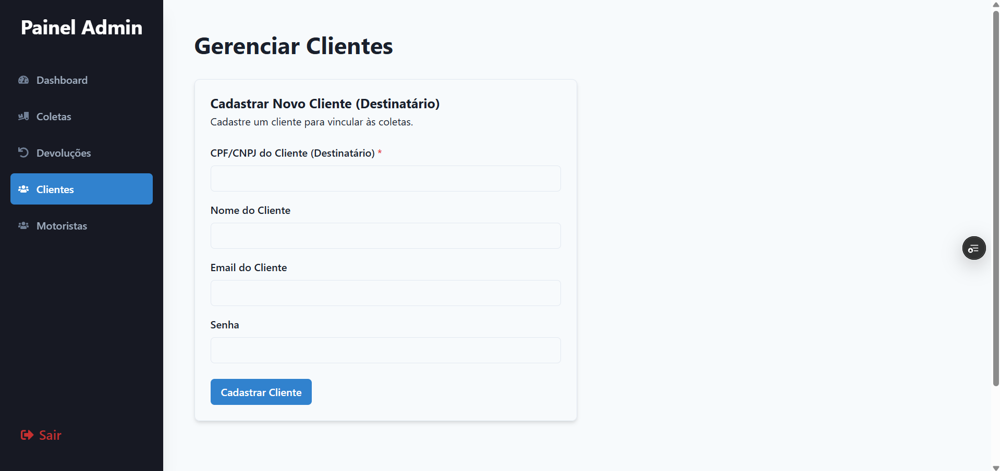
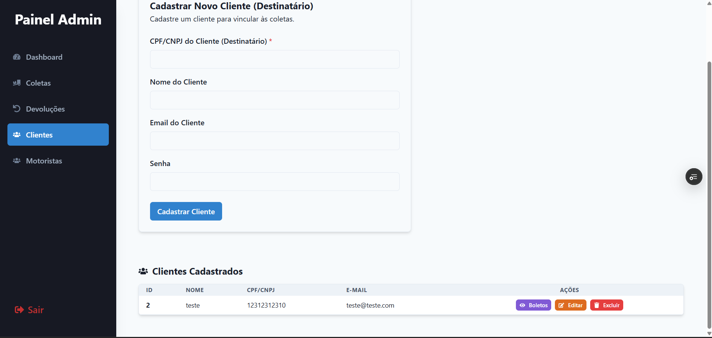
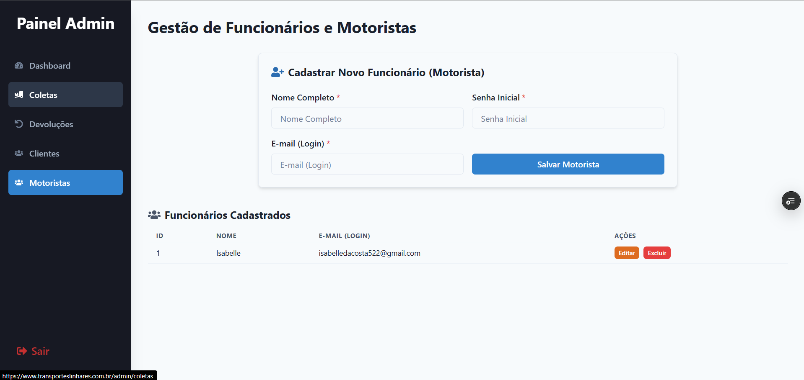
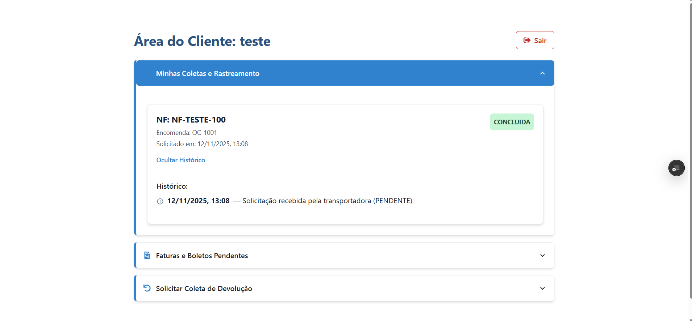
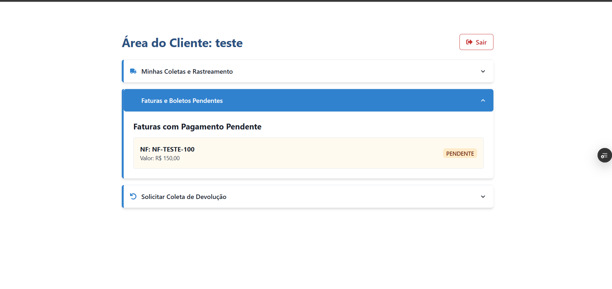
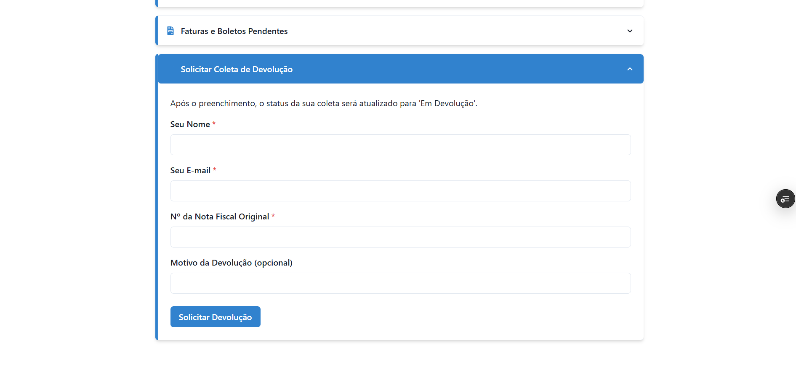

# 🚚 Transportes Linhares - Sistema de Gestão de Coletas (TMS/Admin)

Este projeto implementa um sistema de gerenciamento de transporte (TMS) robusto, focado na gestão de coletas, rastreamento em tempo real e controle administrativo de motoristas e clientes.

## 🚀 Funcionalidades Implementadas

O sistema está dividido em três grandes áreas de funcionalidade: Painel Administrativo, Autenticação e Acesso Público.

### 1. 🛡️ Autenticação e Segurança

| Funcionalidade | Backend (Rotas) | Detalhes |
| :--- | :--- | :--- |
| **Login/Logout Admin** | Login protegido por JWT e `bcrypt`. |
| **Login/Cadastro Cliente** | Login privado para clientes/destinatários com cadastro seguro de CPF/CNPJ e senha (hashing `bcrypt`). |
| **Middleware de Permissão** | Protege as rotas, validando o token JWT e verificando a `role` (`admin` ou `cliente`). |

### 2. 📊 Painel Administrativo (Backend & Frontend)

O Painel Admin é a ferramenta central de gestão, com acesso restrito via token de administrador.

#### A. Dashboard e Estatísticas
| Funcionalidade | Backend (Rotas) | Detalhes |
| :--- | :--- | :--- |
| **Dashboard (Stats)** | Rota protegida que retorna contagem de Coletas no Mês, Coletas Concluídas, Coletas em Aberto e Faturamento Total (Concluídas). |

#### B. Gestão de Coletas (CRUD)
| Funcionalidade | Backend (Rotas) | Detalhes |
| :--- | :--- | :--- |
| **Listar/Filtrar Coletas** | Listagem paginada e filtrável por status (Pendentes, Em Devolução, etc.). |
| **Edição de Coletas** |  Permite que o Admin corrija dados da coleta (frete, NF, cliente, status). |
| **Exclusão de Coletas** |  Exclusão completa da coleta, incluindo exclusão em cascata do histórico de rastreio. |
| **Atualização de Rastreio**|  Adiciona um evento de rastreio (localização e novo status) à coleta pela Nota Fiscal. |

#### C. Gestão de Pessoas e Clientes
| Funcionalidade | Backend (Rotas) | Detalhes |
| :--- | :--- | :--- |
| **Gestão de Funcionários** |  CRUD completo para motoristas e funcionários (criação de login/senha segura). |
| **Gestão de Clientes** |  Listagem de todos os clientes cadastrados no sistema. |
| **Registro de Cliente** |  Rota protegida para o Admin registrar novos clientes. |

### 3. 🌐 Acesso Público e Cliente

| Funcionalidade | Backend (Rotas) | Detalhes |
| :--- | :--- | :--- |
| **Rastreio Rápido (Público)** | Permite rastrear pelo Nº da Encomenda ou Nota Fiscal sem necessidade de login. |
| **Rastreio Destinatário** |  Rastreamento detalhado com validação de CPF/CNPJ. |
| **Solicitar Devolução** | Atualiza o status da coleta para `EM_DEVOLUCAO` e registra a solicitação do cliente. |
| **Área Privada Cliente** |  Listagem protegida de todas as coletas vinculadas ao CPF/CNPJ do cliente logado. |
| **Geração de Documentos** |  Geração dinâmica de PDF de Fatura e Etiqueta (demonstração). |

---

## 🛠️ Tecnologias Utilizadas

* **Backend:** Node.js, Express.js
* **Banco de Dados/ORM:** PostgreSQL, Prisma
* **Autenticação:** JSON Web Tokens (JWT), `bcrypt`
* **Frontend:** React, TypeScript, Chakra UI

## Telas

